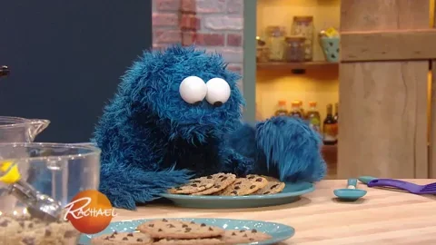

# restaurant-css-framework

## Welcome to my Cookies page

##### Photo by Mae Mu on Unsplash

### Link to home page: https://ch-sophie.github.io/restaurant-css-framework/Welcome 

#### The website is responsive, for small and medium screens. It has five accessible pages: welcome, menu, gallery, restaurants and contact.   

_**Welcome**_    
A page with one Jumbotron and two panels (our story and news).   

_**Menu**_     
A page with the restaurant menu in the form of a grouped list with badges.   

_**Gallery**_        
A page with a gallery of minimum 10 pictures and a pagination (3 photos per page).   

_**Restaurant**_      
A page about the restaurants (it’s a franchise) with its addresses, a map, and different schedules.   

_**Contact**_      
A page with a contact form containing the firstname, lastname, email, subject of the message (a drop-down list with multiple options), an area for the message itself and a send button with an icon. Each entry as a title in a semantically correct tag.   

#### Images credit: Unsplash

#### Thank you for reading.

